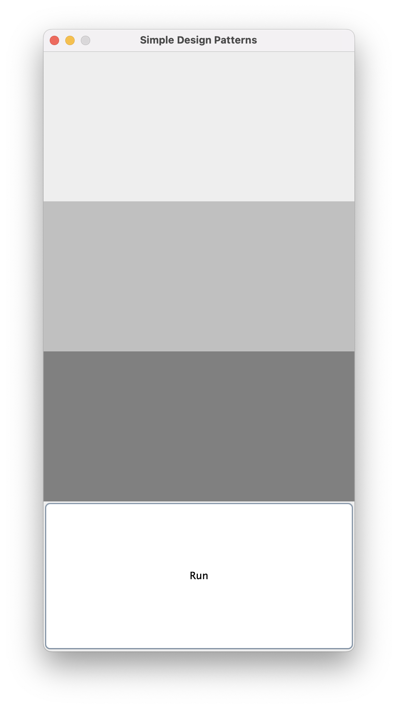
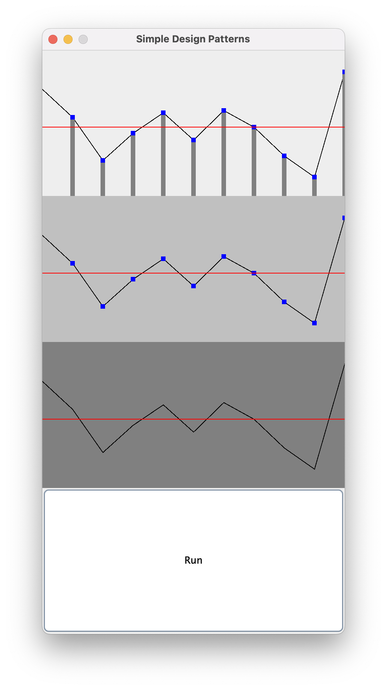

# Simple Design Patterns

## Plot randomly generated data points in real time - uses java design patterns in the backend

  
  

The application has 4 different panels in one column. The bottommost panel is a RUN button. Click this button to start 
program. Periodically, a new point will be added and the graph will be updated in real time.

There are the 3 types of plots:
- Simple plot : plot with points connected with single line
- Marked plot : points are marked with blue square
- Bar plot : points have a bar below them

The 3 panels in the application from bottom to top:
- Simple plot
- Simple plot decorated with marked plot
- Simple plot decorate with marked plot decorated with bar plot

### Design Patterns Used

- Singleton:
  - Class: Evaluator
- Observer Pattern:
  - Class: Source -> Observable
  - Class: PlotPanel -> Observer
- Decorator Pattern:
  - Interface: Drawable
  - Concrete Class: SimplePlot
  - Decorator Abstract Class: DecoratorPlot 
  - Decorator Concrete Class: BarPlot 
  - Decorator Concrete Class: MarkedPlot

